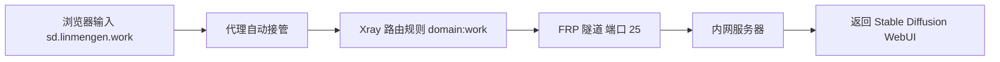

# Infra-Red Assets · 代理管理与穿透控制台

<p align="center">
  
  
  
  
  
  
</p>

Infra-Red Assets 是一个面向自建代理与内网穿透的一体化控制面板，专为境外 VPS 环境设计。它整合了 Xray (Reality 协议)、FRP 内网穿透、精细化流量监控、多级用户管理体系、私有域名路由、资产分发加速 以及 Web 全功能管理界面，提供从基础设施部署到日常运维的完整闭环。

---

✨ 核心特性

类别 特性
代理服务 Xray Reality (VLESS + TCP) / 多用户隔离 / 等级化策略 / 高并发优化
内网穿透 FRP 服务端 / Token 认证 / TCP 隧道 / 私有域名路由（.work） / 虚拟主机支持
管理面板 用户 CRUD / 实时流量图表 / 一键配置下载 / 设备感知导入
资源代理 GeoIP / GeoSite / 客户端安装包 / 规则集（内置 CDN 回源 + GitHub 加速）
安全与证书 自动生成自签名 CA / 动态签发服务器证书 / 强制 HTTPS / 全链路端到端加密
可观测性 gRPC 流量统计（实时速率 + 累计用量） / 月度自动重置 / 系统指标
私有域名路由 支持 业务.用户名.work / 业务.work 格式，通过代理自动解析至内网服务
资产分发加速 Monitor 内置资产代理，客户端/规则集下载速度提升 10 倍以上（毫秒级响应）
个人云服务 通过 WebDAV 在线听歌（dav.用户名.work） / Stable Diffusion WebUI / NAS 等任意内网服务穿透

---

🧩 组件关系

· Xray：提供 Reality 协议代理服务（端口 443），支持多用户、多等级策略，并通过 gRPC API（端口 7600）暴露流量统计数据。
· FRP：作为内网穿透服务端（端口 20），与 Xray 路由联动（可将特定域名流量转入 FRP 隧道），支持虚拟主机模式，实现 *.work 域名到内网服务的精确映射。
· Monitor：基于 Flask 的 Web 面板（端口 5000），负责用户管理、配置生成、证书签发、流量可视化、资产分发加速，并通过 gRPC 与 Xray 通信。
· Assets Proxy：内置资源代理（端口 80），用于分发 GeoIP 数据库、客户端安装包、分流规则集，国内用户下载速度可达 10MB/s+，彻底解决 GitHub 下载瓶颈。
· 私有路由：Xray 路由规则将 .work 域名（如 dav.linmengen.work）定向至 FRP 隧道，实现“开代理即访问内网服务”的零配置体验。

---

🚀 快速部署

环境要求

· Linux (Debian/Ubuntu 20.04+ 推荐)
· root 权限
· 开放端口：20、80、443、5000

一键安装

```bash
curl -sSL https://raw.githubusercontent.com/xlinmengen/proxy-assets/main/setup.sh | bash
```

安装过程会交互式提示输入：

· 管理员邮箱
· 管理员密码

安装后访问

服务 地址 说明
Web 管理面板 https://<VPS_IP>:5000 用户管理 / 流量监控 / 配置下载 / 资产加速入口
FRP 管理面板 http://<VPS_IP>:7500 FRP 服务端状态（认证凭据同管理员）
CA 证书下载 https://<VPS_IP>:5000/cert 用于客户端信任自签名证书
资产库 https://<VPS_IP>:5000/assets 客户端安装包、规则集、GeoIP 等资源一键下载（国内加速）

⚠️ 首次访问需手动信任自签名证书（浏览器会提示不安全，添加例外即可）。

---

👥 用户体系与等级

系统内置三档用户等级，对应不同的 Xray 策略与缓存配置：

等级 权限类型 Xray 等级 缓冲区 (bufferSize) 适用场景
0 管理员 0 (顶级) 16 MiB 全权限管理，高吞吐需求
1 普通用户 1 (优质) 8 MiB 常规使用，中等流量
2 普通用户 2 (标准) 4 MiB 基础使用，低资源消耗

· 管理员：可增删用户、重置密钥、修改全局认证、查看所有流量。
· 普通用户：仅可查看自己的流量、下载配置、修改密码。

---

🌐 私有域名路由（.work 内网穿透）

命名规范

类型 格式 示例 说明
个人业务 业务.用户名.work sd.linmengen.work 私有服务，仅本人/授权用户可访问
公共业务 业务.work assets.work 公开服务，所有代理用户可访问

工作原理



支持的内网服务（无限扩展）

子域名 内网服务 说明
dav.linmengen.work WebDAV 在线听无损 FLAC 音乐
sd.linmengen.work Stable Diffusion WebUI AI 绘画
nas.linmengen.work 群晖 / 威联通 NAS 文件管理
git.linmengen.work Gitea / GitLab 私有代码仓库
code.linmengen.work VS Code Server 云端开发环境
jellyfin.work Jellyfin 公共媒体服务器

任意内网服务，配个子域名即可通过 https://业务.用户名.work 从外网访问，无需 VPN，无需公网 IP。

---

📦 资产分发加速（GitHub 镜像）

痛点

国内从 GitHub 下载客户端（Clash Verge、FRP 等）速度极低（通常低于 50 KB/s），一个 50 MB 的安装包可能需要 30 分钟以上。

解决方案

Monitor 内置资产代理，自动缓存 GitHub Releases 中的客户端安装包、规则集、GeoIP 数据。

· 用户访问 https://<VPS_IP>:5000/assets，点击下载
· 速度可达 10 MB/s+（取决于 VPS 带宽）
· 十几秒完成原本需要半小时的下载任务

技术实现

· 后台线程 update_assets.py 定期从 GitHub 拉取最新资源
· 本地缓存至 /opt/monitor/datas/database/
· 用户请求时直接返回缓存，无回源延迟

这相当于您自建了一个“国内可直连的 GitHub CDN”。

---

📱 客户端集成

一键导入（自动识别设备）

Web 面板中点击 “一键导入” 按钮，系统会根据 User-Agent 自动唤起对应客户端：

设备类型 客户端 协议
Android Clash Meta intent://
iOS Shadowrocket shadowrocket://
Windows / macOS / Linux Clash Verge clash://

手动配置

1. 下载根证书：https://<VPS_IP>:5000/cert 并安装为受信任的 CA。
2. 在 Web 面板中点击 “下载配置” 获取 config.yaml。
3. 导入客户端（Clash Meta / Verge / Shadowrocket 均可）。

生成的配置示例

```yaml
proxies:
  - name: "WORK-REMOTE"
    type: vless
    server: <VPS_IP>
    port: 443
    uuid: <用户UUID>
    network: tcp
    tls: true
    flow: xtls-rprx-vision
    servername: www.microsoft.com
    reality-opts:
      public-key: <服务器公钥>
      short-id: <用户短ID>
    client-fingerprint: chrome
```

---

🔌 内网穿透 (FRP) 高级用法

服务端（已自动配置）

· 绑定端口：20 (TCP 穿透)
· 认证方式：Token（自动生成）
· 管理界面：http://<VPS_IP>:7500（认证凭据同管理员）
· 虚拟主机支持：通过 vhostHTTPPort = 25 实现域名转发

客户端配置示例（暴露 Web 服务）

```toml
serverAddr = "<VPS_IP>"
serverPort = 20
auth.token = "<面板中的Token>"

[[proxies]]
name = "sd-webui"
type = "http"
localIP = "127.0.0.1"
localPort = 7860
customDomains = ["sd.linmengen.work"]
```

客户端配置示例（暴露 TCP 服务）

```toml
[[proxies]]
name = "ssh-tunnel"
type = "tcp"
localIP = "127.0.0.1"
localPort = 22
remotePort = 6000
```

💡 结合 Xray 路由规则（domain:work → frp_tunnel），访问 sd.linmengen.work 会自动走 FRP 隧道穿透到您家中的 Stable Diffusion 服务。

---

📊 流量统计与监控

· 实时速度：每秒通过 gRPC 拉取，区分上行/下行。
· 累计流量：按用户独立存储，每月 1 日自动重置。
· 系统指标：Xray 内存占用、运行时间等。
· API 接口：/api/xray/traffic、/api/xray/all-traffic 等（用于前端轮询）。

---

🛠️ 运维指南

服务管理

```bash
systemctl status xray      # Xray 服务
systemctl status frps      # FRP 服务端
systemctl status monitor   # Web 面板

systemctl restart xray frps monitor
```

日志查看

```bash
journalctl -u xray -f -n 100
journalctl -u monitor -f -n 50
```

防火墙（已预配置）

开放端口：20、80、443、5000
查看当前规则：ufw status verbose

备份与恢复

· 用户数据：/opt/monitor/datas/settings.json
· Xray 配置：/opt/xray/config.json
· FRP 配置：/opt/frps/frps.toml
· 证书目录：/opt/monitor/certs/

建议定期备份以上目录。

---

📁 目录结构

```
/opt/
├── xray/                     # Xray 服务端
│   ├── xray                  # 二进制
│   └── config.json           # 动态生成（用户/密钥）
├── frps/                     # FRP 服务端
│   ├── frps                  # 二进制
│   └── frps.toml             # 配置文件
├── monitor/                  # Web 面板根目录
│   ├── main.py               # Flask 主程序
│   ├── settings.py           # 用户/配置管理
│   ├── xray_stats.py         # gRPC 统计模块
│   ├── mkcert.py             # 证书生成器
│   ├── update_assets.py      # 资产后台更新（GitHub 缓存）
│   ├── datas/                # 数据存储
│   │   ├── settings.json     # 用户、密钥、认证
│   │   ├── config.yaml       # 客户端配置模板
│   │   └── database/         # GeoIP 等缓存
│   ├── certs/                # CA 与服务器证书
│   ├── static/               # CSS/JS 资源
│   └── templates/            # HTML 模板
└── repo/                     # 客户端安装包缓存（资产加速）
    ├── frp_windows_amd64.zip
    ├── frp_linux_amd64.zip
    └── frp_darwin_amd64.zip
```

---

⚙️ 系统调优参数

安装脚本会自动应用以下优化（/etc/sysctl.conf）：

参数 值 说明
net.core.default_qdisc fq 为 BBR 提供公平队列
net.ipv4.tcp_congestion_control bbr 启用 BBR 拥塞控制
net.core.rmem_max / wmem_max 128 MiB 最大接收/发送缓冲区
net.ipv4.tcp_rmem / wmem 4K–128M 动态缓冲区范围
net.ipv4.tcp_fastopen 3 启用 TFO
net.ipv4.tcp_slow_start_after_idle 0 禁用空闲后慢启动
net.ipv4.tcp_keepalive_time 300 保活探测间隔
net.core.somaxconn 65535 监听队列长度

CPU 调速器设为 performance，文件描述符上限提升至 1024000。

---

❓ 常见问题

1. 代理速度远低于 VPS 标称带宽？

· 可能原因：本地网络（尤其是广电、长城等二级运营商）上行带宽不足。
· 验证方法：在家庭服务器上执行 iperf3 -c <VPS_IP>，观察上行速率。
· 解决方案：更换为电信/联通宽带；或使用 FRP xtcp 模式尝试 P2P 穿透。

2. 浏览器提示“证书不受信任”？

· 下载 https://<VPS_IP>:5000/cert 并安装为受信任的根证书（Windows 需导入“受信任的根证书颁发机构”）。

3. 流量统计显示为 0 或不准？

· 检查 Xray 配置中 policy 是否开启 statsUserUplink / statsUserDownlink。
· 确认 Xray API 端口 7600 可访问：netstat -tlnp | grep 7600。

4. 如何更新 Xray 到最新版？

```bash
systemctl stop xray
wget -O /tmp/xray.zip https://github.com/XTLS/Xray-core/releases/latest/download/Xray-linux-64.zip
unzip -p /tmp/xray.zip xray > /opt/xray/xray
chmod +x /opt/xray/xray
systemctl start xray
```

5. 如何添加新的 .work 子域名服务？

1. 在 FRP 客户端（您家服务器）添加一个 http 或 tcp 代理，customDomains = ["新业务.用户名.work"]。
2. 确保 Xray 路由规则包含 domain:work → frp_tunnel（默认已配置）。
3. 开代理，浏览器访问 http://新业务.用户名.work 即可。

6. 资产下载速度还是很慢？

· 检查 Monitor 服务是否正常运行：systemctl status monitor
· 检查防火墙是否开放 5000 端口
· 手动访问 https://<VPS_IP>:5000/assets 确认页面可打开

7. 是否支持多节点/负载均衡？

当前版本为单节点设计。多节点可借助外部 DNS 轮询或上游 Nginx 代理实现。

---

🤝 贡献与反馈

欢迎提交 Issue 或 Pull Request。
项目地址：https://github.com/xlinmengen/proxy-assets

---

📄 许可证

MIT License
Copyright © 2025 xlinmengen

---

🙏 致谢

· XTLS/Xray-core – 核心代理引擎
· fatedier/frp – 内网穿透框架
· MetaCubeX – GeoIP/GeoSite 数据
· Loyalsoldier/clash-rules – 分流规则集
· Clash Verge Rev – 跨平台客户端

<p align="center">
  <sub>Infra-Red Assets · Maintained by <a href="https://github.com/xlinmengen">xlinmengen</a></sub>
  <br>
  <sub>© 2026 xlinmengen · MIT Licensed</sub>
</p>
